## Learned Optimizer with Diffusion Models
Course project for CS236 by Chaitanya Patel and Apoorv Srivastava

## More Results
Input 2D keypoints(left), generated poses with three values of w (middle), groundtruth (right).
Green keypoints are input conditioning. Red keypoints correspond to the generated poses.

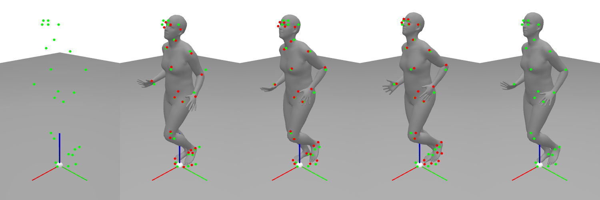
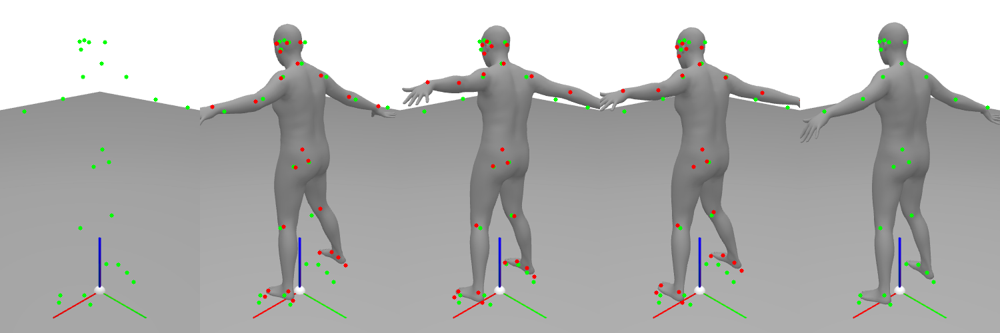
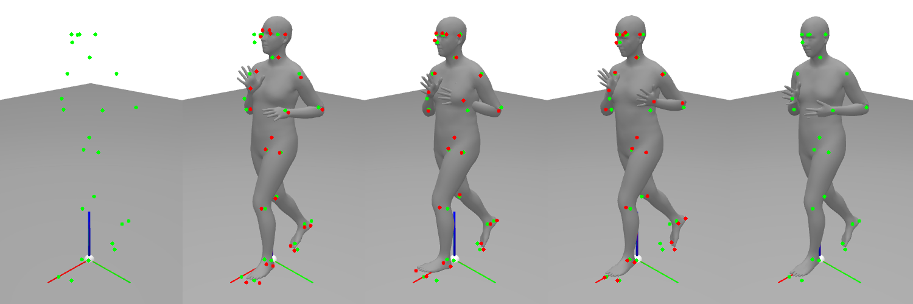
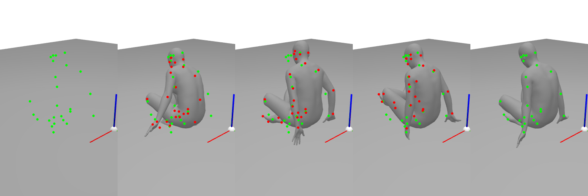
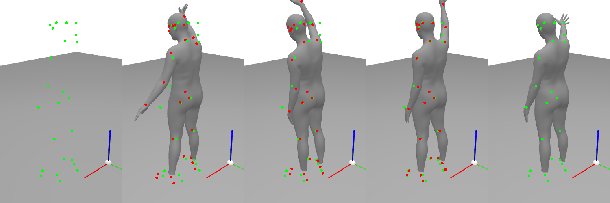
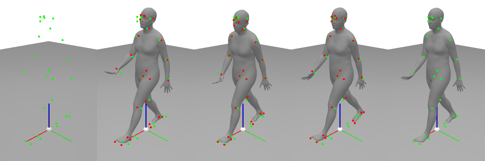
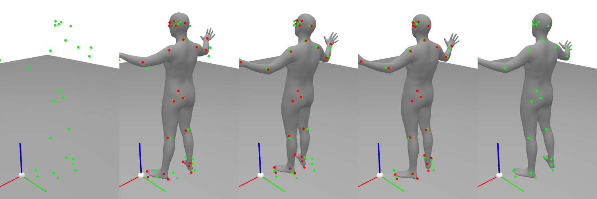
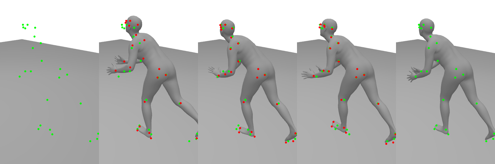
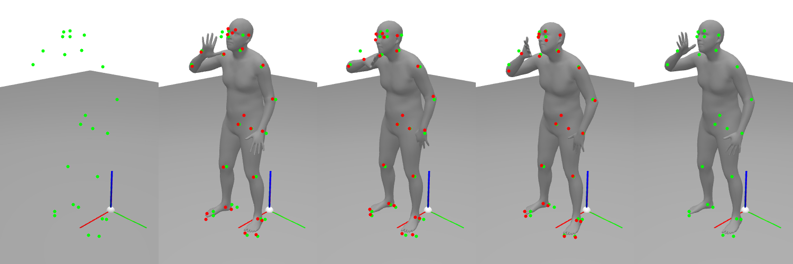
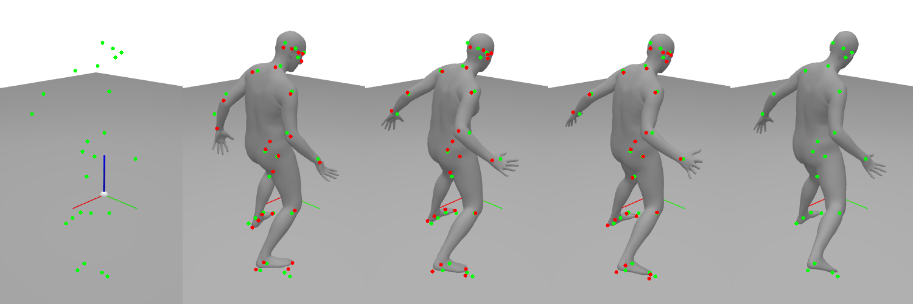
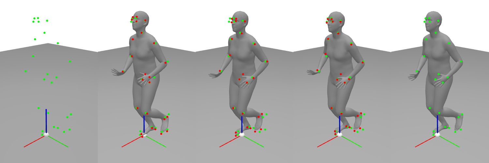
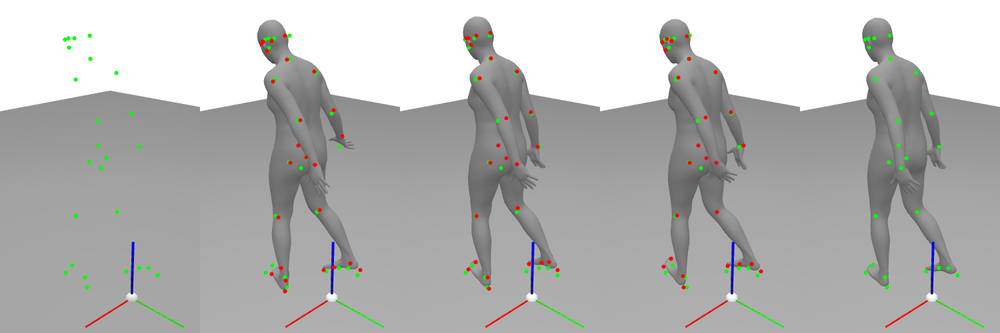
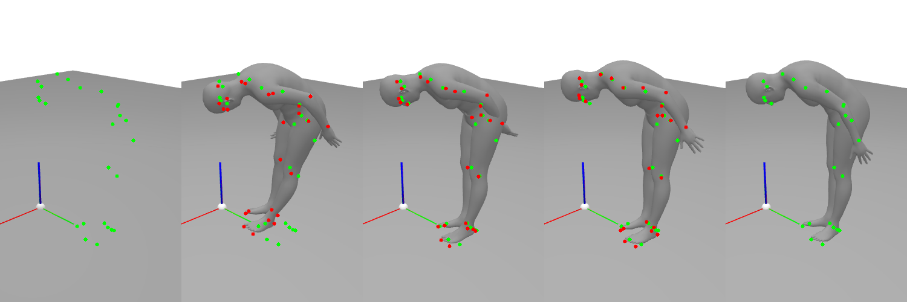
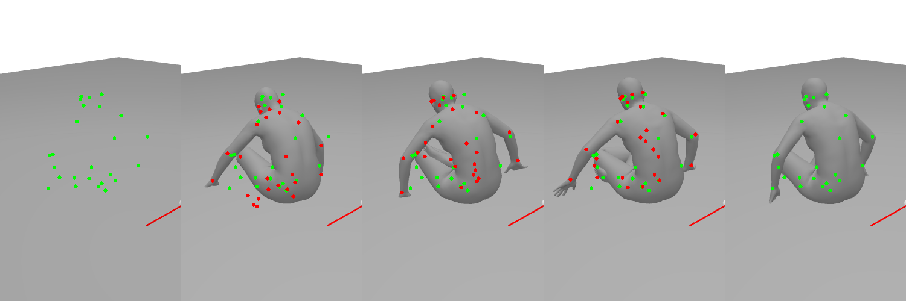

